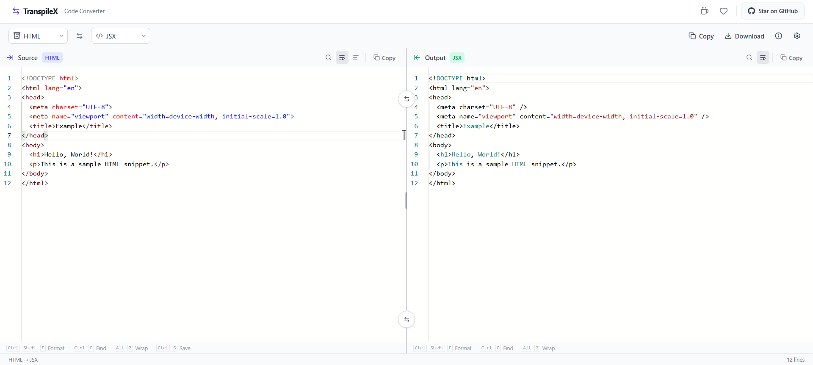

  

<h1 align="center">TranspileX</h1>

  <strong>Convert code between languages instantly.</strong> 
  A lightweight, zero‑setup code converter for HTML, JSX, TSX, JSON, Markdown, SVG and more.

  

  

---

## What is TranspileX?

**TranspileX** is a free, open‑source code conversion tool that lets you transform code between different syntaxes and languages. Select a source language, paste or write your code, and see the converted result appear instantly in the output panel.

It’s designed for developers who need to quickly convert HTML to JSX, SVG to TSX, JSON to TypeScript interfaces, Markdown to HTML, and more – all without leaving the browser.

---

## Why TranspileX?

Converting code by hand is tedious and error‑prone. TranspileX automates the process with a clean, modern interface:

- **Instant conversion** – See results as you type (debounced).
-  **Smart auto‑selection** – Picks the most sensible output language when you choose a source.
-  **Persistent storage** – Your code and settings are saved locally.
-  **Dark & Light themes** – Works in any lighting condition.
-  **Multiple converters** – Supports several common language pairs.

No account, no sign‑up, no server uploads – everything runs locally in your browser.

---

## Features

###  Live Conversion
Two side‑by‑side editors (Source & Output) with Monaco editor – the same engine used in VS Code. Changes are converted automatically with a 100ms debounce.

###  Intelligent Language Selection
When you pick a source language, TranspileX automatically suggests the most relevant target language. If no converter exists for your pair, a friendly notification tells you which targets are available.

###  Supported Languages & Converters

| Source | Target | Converter |
|--------|--------|-----------|
| HTML   | JSX    | Attribute transforms, style objects, self‑closing tags |
| HTML   | TSX    | Same as JSX |
| JSX    | HTML   | className → class, style objects → inline, event handlers |
| SVG    | JSX    | HTML → JSX + SVG attribute camelCasing + namespace removal |
| SVG    | TSX    | Same as JSX |
| Markdown| HTML  | Headings, lists, code blocks, links, images, blockquotes |
| JSON   | TSX/TS | Generates TypeScript interfaces (nested objects, arrays, primitives) |

More converters are planned for future releases (CSS ↔ SCSS, GraphQL → TypeScript, etc.).

###  Editor Customization
- **Font family** – Choose from JetBrains Mono, Fira Code, Consolas, Monaco, Courier New.
- **Font size** – Adjust from 10px to 20px.
- **Word wrap** – Toggle on/off.
- **Theme** – Dark, Light, or System (follows your OS preference).

###  Persistent Storage
All your code, selected languages, and editor settings are saved to `localStorage`. Close the tab, come back later – everything is exactly where you left it.

###  Copy & Download
- **Copy** – Copy the output code to your clipboard.
- **Download** – Download the output as a file with the correct extension.

###  Smart Notifications
- Auto‑selected language → blue info banner.
- Unsupported conversion → amber warning banner with suggested alternatives.
- Combined banners when auto‑select happens but no converter exists for that pair.

###  Conversion Info Panel
Click the info (i) button to see:
- Current source/target languages.
- Whether the conversion is supported.
- List of all available target languages for the current source.

### Built‑in Sample Snippets
Each supported language comes with a ready‑to‑use sample, so you can start experimenting immediately.

---

## How to Use

| Action | How to do it |
|--------|--------------|
| **Select source language** | Click the dropdown on the left (e.g., "HTML") |
| **Select target language** | Click the dropdown on the right (or let it auto‑select) |
| **Write code** | Type directly in the source editor |
| **See conversion** | Output updates automatically |
| **Copy output** | Click the "Copy" button in the toolbar |
| **Download output** | Click the "Download" button – file extension matches the target language |
| **View conversion info** | Click the info (i) button in the toolbar |
| **Open settings** | Click the gear icon (⚙️) to change font, size, and theme |
| **Swap languages** | Click the swap button (⇄) between the two dropdowns |
| **Dismiss a notification** | Click the X on the notification banner |
| **Clear output** | Delete the source code → output clears automatically |

---

## Tech Stack

| Technology | Purpose |
|------------|---------|
| **React 19** | UI framework |
| **TypeScript** | Type safety |
| **Tailwind CSS v4** | Styling |
| **Vite 6** | Build tool |
| **Monaco Editor** | Code editor engine (VS Code’s editor) |
| **Lucide React** | Icons |
| **React Icons** | Additional icon sets |
| **Prettier** | Code formatting (for output) |

---

## How It Works (Deep Dive)

### Conversion Pipeline

1. **Input** – User types code in the source editor.
2. **Debounce** – A 100ms delay prevents excessive conversions.
3. **Language Pair Lookup** – The `converters` registry maps `source-to-target` to a converter function.
4. **Conversion** – The function transforms the code (e.g., regex replacements, AST manipulation via string parsing or Prettier).
5. **Formatting** – The output is passed through Prettier to ensure consistent indentation and syntax.
6. **Render** – The formatted code appears in the output editor.

### Smart Auto‑Selection

- When the source language changes, the app looks for the first available conversion pair.
- If found, it updates the target and shows a blue notification.
- If no converter exists, it shows a warning and lists available targets (if any).
- If the user manually changes the target, the app respects their choice and only validates if the pair is supported.

### State Persistence

- `useConverter` hook stores the input, output, source, and target.
- `useSettings` stores font family and size.
- All are synced to `localStorage` on every change.
- On load, the app hydrates from localStorage, so you never lose your work.

### Sample Loading

- On first visit (or when the source language changes) and **no user input exists**, the app loads a sample snippet for that language.
- Once the user starts typing, no further samples are loaded – your code is preserved.

### Monaco Editor Integration

- Fully configured with TypeScript/JSX support, bracket pair colorization, sticky scroll, folding, IntelliSense, and auto‑closing tags.
- Custom snippets for React hooks (`useState`, `useEffect`, etc.) are available in JSX/TSX editors.

---
---

  © 2026 TranspileX - Open Source MIT

